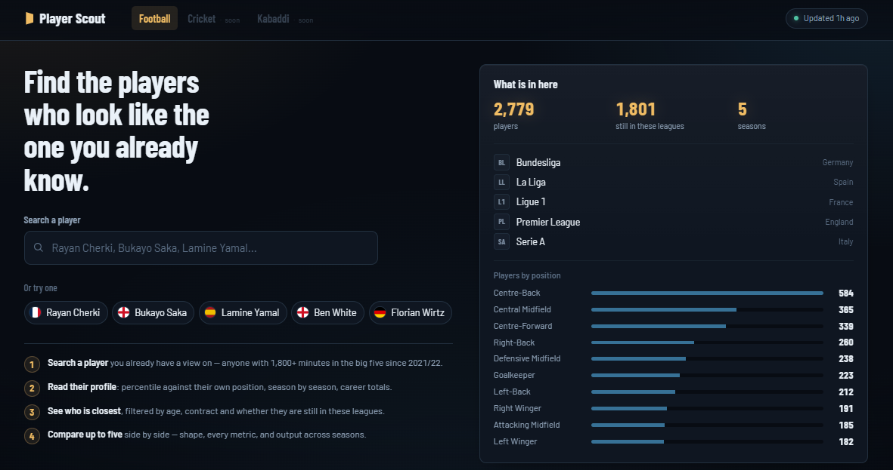
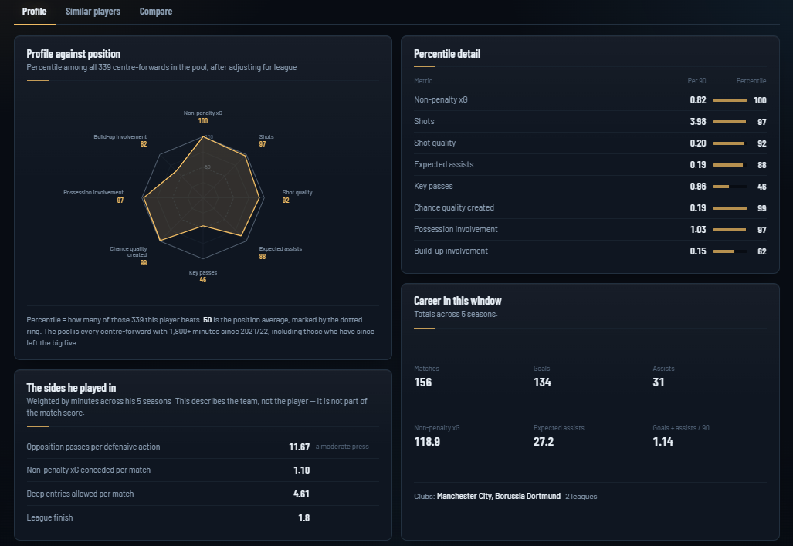
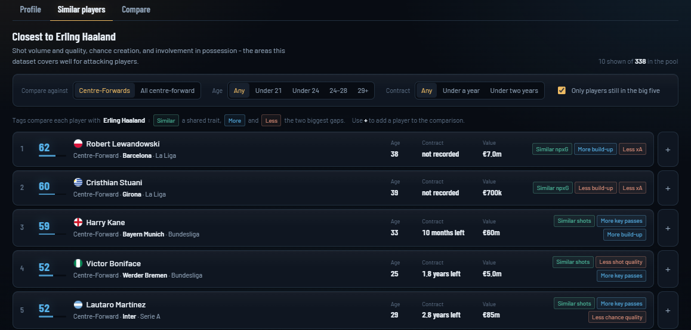
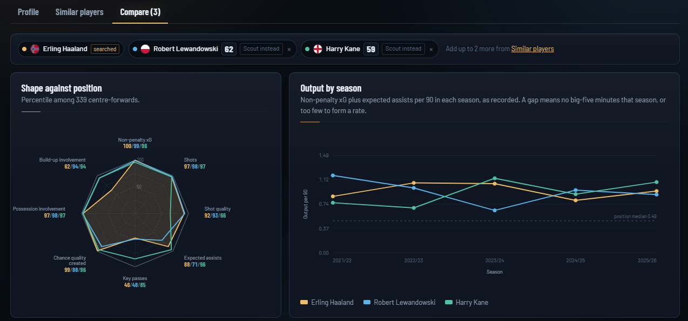
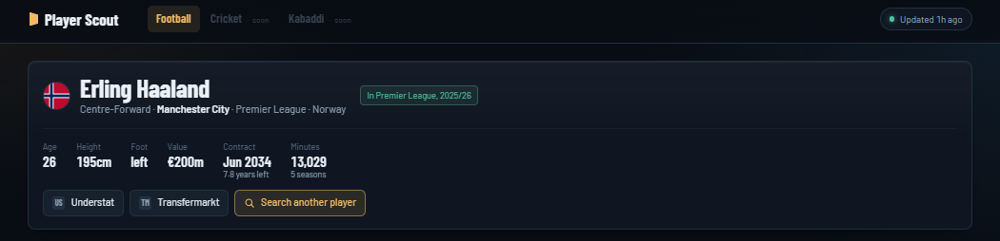

# Player Scout

**Search a footballer and see who else plays like them.**

A scouting tool that turns five seasons of European football into one question:
given a player you already have a view on, who is the closest equivalent — and
where exactly do they differ?



---

## Two ways to use it

**Find someone new.** Search a player, read their profile, then see the ten
closest matches filtered by age, contract, minutes and whether they are still in
these leagues.

**Compare players you already have in mind.** Open the Compare tab and search for
anyone in the pool. They do not have to appear in the similar list — line up to
six side by side and read every metric against each other.

Both routes feed the same comparison, and anything worth keeping can be saved to
a shortlist that survives between visits.

| | |
| --- | --- |
| **Players** | 3,245 |
| **Seasons** | 2021/22 to 2025/26, complete |
| **Leagues** | England, Spain, Germany, Italy, France |
| **In the model** | 1,200+ minutes across the window |
| **Shown by default** | 1,800+ minutes, adjustable |
| **Still active in those leagues** | 1,801 |

---

## What each player carries

One row per player per season, 13,980 in all, combining three kinds of
information on the same line.

**Playing record** — minutes, appearances, goals, assists, shots, key passes,
expected goals, non-penalty expected goals, expected assists, and two
possession-involvement measures: the total expected goals of every move a player
took part in, and the same excluding their own shots and key passes.

**Player record** — date of birth, nationality, height, preferred foot,
positional label, contract expiry, market value, current club.

**Team record** — for every club season: pressing intensity, expected goals
conceded, deep entries allowed, league finish.

Fourteen comparison metrics are derived per 90 minutes: shot volume and quality,
goals and finishing against expectation, expected assists, key passes, chance
quality created, assists, three involvement measures, and two **share** metrics —
how much of a team's threat and build-up ran through the player while he was on
the pitch. Those two matter because they normalise for how good the side was: a
player carrying a modest attack and a passenger in a great one can post identical
per-90 figures and mean completely different things.


---

## How the master file was assembled

The three kinds of record arrive separately and share no player identifier, so
they are matched on name, club and minutes across six passes of decreasing
strictness. Each row records which pass matched it and how confident it was.

| Pass | Rule | Rows |
| --- | --- | --- |
| `exact_name` | identical normalised name, same league and season | 12,556 |
| `club_fuzzy` | same club, fuzzy name, corroborated by minutes | 995 |
| `token_minutes` | shared name component, same club, minutes agree within 8% | 44 |
| `league_fuzzy` | strong name match anywhere in the league — catches loan spells | 39 |
| `surname_club` | shared surname inside the same club | 14 |
| `cross_season` | absent this season, present in another; borrows the date of birth | 111 |

**98.6% matched overall, 99.9% among players with 900+ minutes.**

Three decisions do most of the work:

- **Club names are learned, not listed.** The records spell clubs differently, so
  the mapping is derived from the confident name matches rather than maintained
  by hand. 128 equivalences fall out automatically.
- **Minutes are a fingerprint.** Within one club-season, minutes played is close
  to unique. That lets a shared name component plus agreement to within 8% form a
  safe match where fuzzy names fail — the records often keep different parts of a
  long name.
- **Identity is resolved once, globally.** Two people share a display name more
  often than you would guess. Records are assigned one-to-one, strongest claim
  first, so two players can never end up sharing a date of birth. Anyone who
  loses every claim is left without a record rather than given someone else's.

Thresholds are deliberately strict. Loosened enough to catch the last few
stragglers, fuzzy matching starts pairing a squad player named Robert with Robert
Lewandowski at a perfect score. A blank contract date is visible; a wrong one is
not. Pairs the matcher cannot infer live in `config/aliases.csv`, one line each.

---

## How the tool works



### One profile per player, not per season

Rates come from summed totals over summed minutes, so a 3,000-minute season
outweighs a 200-minute one. Seasons under 270 minutes are excluded from per-90
charts — a two-minute cameo divides out to nonsense.

### League adjustment, per metric

A goal is not equally hard to come by everywhere, and **no league is uniformly
harder**. One coefficient is fitted per metric per league: Ligue 1 inflates
expected goals but suppresses key passes, Serie A does the reverse.


Each is fitted from the **624 players who appear in more than one league**,
measuring the same person before and after a move. Comparing whole leagues
instead would only reveal which has the better players.

### Fourteen metrics into a handful of axes

Several metrics measure the same thing twice: anyone who shoots often also has
high non-penalty expected goals. Principal component analysis folds them into a
smaller set of independent axes, and similarity is the distance between two
players across them. Each position is fitted separately, because what
distinguishes wingers is not what distinguishes centre-backs.


**How many axes to keep was decided by testing, not by picking a round share of
the variance.** Holding back at 80% cost real accuracy — right wingers found
themselves at median rank 34 on four axes and 23 on seven. A small share of the
variation is not the same thing as noise.

Those axes also answer *why* two players matched. Each result carries a line like
*"Both high for possession and final third"*, read from where the pair sit on the
axis that separates their position most.

### Team context, never a team rating

Pressing intensity is one number for eleven people. Assigning it to an individual
would make everyone at the same club look alike, so it is shown as context — a
panel describing the sides a player turned out for — and kept out of the
similarity model entirely. The interface says so on the panel.

### Ranked results



Ten closest profiles, re-ranked live as you filter. Each row shows a match score
out of 100, one trait the two players share, the two largest differences, and the
reason they matched. Arrow keys walk the list, `S` saves, `+` adds to the
comparison.

### Comparison



Up to six players at once, from the similar list or by searching the whole pool.
Overlaid percentile shapes, every metric on a shared track with one column per
player, and output by season on a common axis.

---

## Does it hold up?

If a tool claims two players are alike, the first thing to check is whether it
can spot the most obvious case of all: a player and himself.

So each player is split in two — his early seasons and his later ones — and
treated as two strangers. Hand the tool the early version, ask it to rank
everyone, and see where the later version comes out.


An attacking midfielder lands **18th of 161**. Guessing at random would put him
81st. The tool has never seen the two halves as the same person; it recognises
the way he plays.

Well ahead of chance everywhere, and nowhere near certain. Centre-backs do worst
because the data holds nothing about defending. **Goalkeepers are not ranked at
all** — at 57th of 160 against a chance of 80, a list would be close to random.
They still get percentiles for build-up involvement, with a note that the measure
reflects a team's possession as much as the keeper.

---

## What it cannot see

The playing record covers shooting, chance creation and involvement in
possession. It contains no tackles, interceptions, duels, clearances or
goalkeeping actions.

Defenders are therefore compared on what they contribute going forward, and the
results header says so rather than implying otherwise. This is a limitation of
what is available, not a design choice, and the interface states it on first view
rather than burying it.

---

## Keeping it current



Three workflows, each doing one job.

**Update data** — run when a season finishes. Collects both records, matches
them, rescores every player, commits. The site redeploys itself. Four inputs:
leagues, seasons, mode (`add_missing`, `refresh` or `rebuild`), and a dry run.
Fifteen to forty minutes.

Wait until a season has actually finished. Part-season rates come from tiny
samples and would distort a career profile, which is why the workflow has no
schedule.

**Refresh clubs** — runs on the 1st and 15th, just after the European windows
shut. Updates current club, market value and contract for every player already
in the master, then rebuilds the site data. Nothing derived from match data is
recalculated: a transfer is not a reason to rescore anyone.

**Rebuild scores** — for when the data is fine but the model changed. Reads the
master already in the repository, downloads nothing.

Every run writes a report, and the interface reads them: the **Updated** chip in
the masthead shows when the season data, the clubs and the model each last ran,
in IST or UTC.

**If a regular player fails to match**, the run summary names them. Add a line to
`config/aliases.csv` and rerun with mode `refresh`. Only add one when you are
certain — the alias file overrides all matching logic.

---

## Layout

```
config/
  leagues.yml         which leagues exist and where each record comes from
  aliases.csv         name equivalences the matcher cannot infer
pipeline/
  resolve_leagues.py  league keys to each source's codes
  pull_understat.py   the playing and team records
  build_squads.py     the player record
  merge_master.py     matching and incremental merge — six passes
  refresh_clubs.py    fortnightly club, value and contract refresh
  build_scores.py     the model
  stamp_assets.py     versions the stylesheet and script against stale caches
  *_report.py         run summaries
data/
  master_players.csv  one row per player per season
  team_seasons.csv    one row per club per season
  reports/            one JSON per run, recording exactly what changed
site/
  index.html · app.js · style.css · assets · data
```

No framework and no build step. The page is plain HTML, CSS and JavaScript
reading three JSON files, and ranking happens in the browser so filters re-rank
against the whole pool rather than filtering a frozen list.

The shortlist lives in the browser's own storage and never leaves the device; it
exports to CSV for anywhere else.

---

## Sharing a view

The address bar tracks what you are looking at, so any view is linkable:

```
?p=us7322&tab=compare&with=us8015,us11094
```

That lands on a specific player with two others already in the comparison.

---

## Running it locally

Not required — the workflows do all of this — but if you want to:

```bash
pip install -r requirements.txt
python pipeline/build_scores.py
cd site && python -m http.server 8000
```
