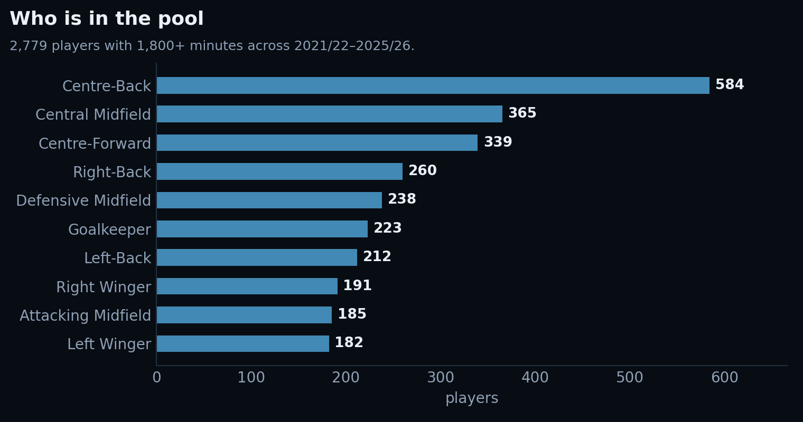
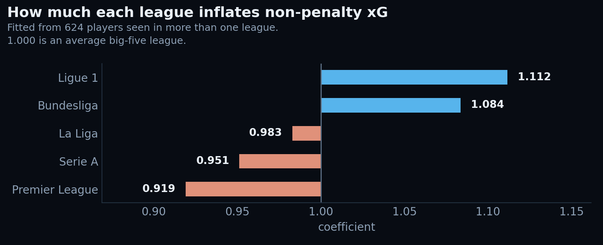
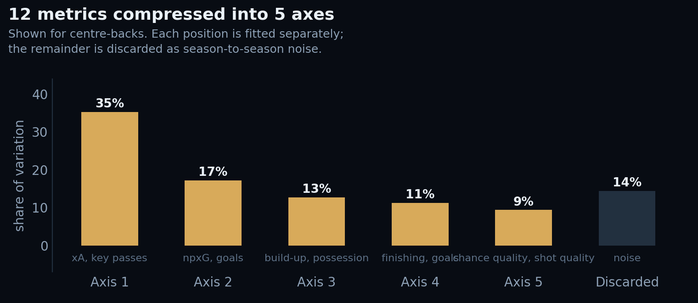
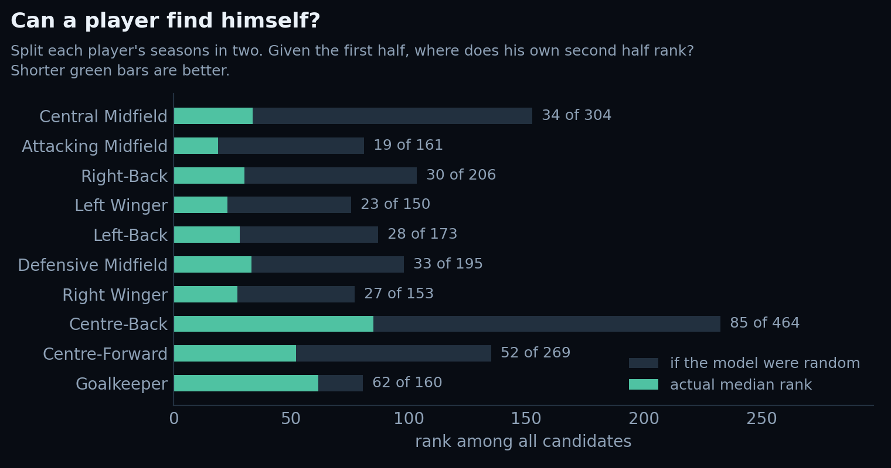

# Player Scout

**Search a footballer and see who else plays like them.**

A scouting tool that turns five seasons of European football into a single
question: given a player you already have a view on, who is the closest
equivalent, and where exactly do they differ?



---

## What it does

Type a name. Get that player's profile measured against everyone else in their
position, the ten closest matches filtered by age and contract, and a
side-by-side comparison of up to five players across every metric.

| | |
| --- | --- |
| **Players** | 2,779 |
| **Seasons** | 2021/22 to 2025/26, complete |
| **Leagues** | England, Spain, Germany, Italy, France |
| **Qualification** | 1,800+ minutes across the window |
| **Still active in those leagues** | 1,801 |

---

## The data

### What each player carries

One row per player per season, 13,980 in all, combining two kinds of
information on the same line.

**Playing record** — minutes, appearances, goals, assists, shots, key passes,
expected goals, non-penalty expected goals, expected assists, and two
possession-involvement measures: the total expected goals of every move a player
took part in, and the same excluding their own shots and key passes.

**Player record** — date of birth, nationality, height, preferred foot,
positional label, contract expiry, market value, current club.

From those, twelve comparison metrics are derived per 90 minutes: shot volume
and quality, goals and finishing against expectation, expected assists, key
passes, chance quality created, assists, and three involvement measures
including a final-third figure computed as total involvement minus build-up.

### How the master file was assembled

The two kinds of record arrive separately and share no player identifier, so
they are matched on name, club and minutes across six passes of decreasing
strictness. Each row records which pass matched it and how confident it was.

| Pass | Rule | Rows |
| --- | --- | --- |
| `exact_name` | identical normalised name, same league and season | 12,556 |
| `club_fuzzy` | same club, fuzzy name, corroborated by minutes | 995 |
| `token_minutes` | shared name component, same club, minutes agree within 8% | 44 |
| `league_fuzzy` | strong name match anywhere in the league — catches loan spells | 39 |
| `surname_club` | shared surname inside the same club | 14 |
| `cross_season` | absent this season, present in another; borrows the date of birth | 111 |

**98.6% matched overall, 99.9% among players with 900+ minutes.**

Three decisions do most of the work:

- **Club names are learned, not listed.** The two records spell clubs
  differently, so the mapping is derived from the confident name matches rather
  than maintained by hand. 128 club equivalences fall out automatically.
- **Minutes are a fingerprint.** Within one club-season, minutes played is close
  to unique. That lets a shared name component plus agreement to within 8% form
  a safe match where fuzzy names fail — the two records often keep different
  parts of a long name.
- **Identity is resolved once, globally.** Two people genuinely share a display
  name more often than you would expect. Player records are assigned one-to-one,
  strongest claim first, so two players can never end up sharing a date of birth.
  Anyone who loses every claim is left with no record rather than someone else's.

Thresholds are deliberately strict. Loosened far enough to catch the last few
stragglers, fuzzy matching starts pairing a squad player named Robert with
Robert Lewandowski at a perfect score. A blank contract date is visible; a wrong
one is not.

Name pairs the matcher cannot infer live in `config/aliases.csv`, one line each.

---

## How the tool works

*Screenshots of the interface live in [docs/screenshots](docs/screenshots).*

### One profile per player, not per season

Rates come from summed totals over summed minutes, so a 3,000-minute season
outweighs a 200-minute one. Seasons under 270 minutes are excluded from per-90
charts — a two-minute cameo divides out to nonsense.

### League adjustment

A goal is not equally hard to come by everywhere. Every rate is divided by a
coefficient for the league it was produced in, fitted from the **624 players who
appear in more than one league**, measuring the same person before and after a
move. Comparing whole leagues instead would only reveal which has the better
players.



### Twelve metrics into four or five numbers

Several metrics measure the same thing twice: anyone who shoots often also has
high non-penalty expected goals. Principal component analysis folds them into a
smaller set of independent axes — for right wingers, four axes carrying 87% of
what separates them. Similarity is the distance between two players across those
axes, and each position is fitted separately, because what distinguishes wingers
is not what distinguishes centre-backs.



Widening a search to a position group uses a second analysis fitted across that
group, since coordinates from different fits are not comparable.

### Ranked results

Ten closest profiles, re-ranked live as you filter by age bracket, contract
remaining, or whether a player is still in these leagues. Each row shows a match
score out of 100, and three tags: one trait the two players share, and the two
largest differences with direction.

### Comparison

Up to five players at once. Overlaid percentile shapes, every metric on a shared
percentile track with one column per player, and output by season on a common
axis.

---

## Does it hold up?

Each player's seasons are split into two halves and a profile built from each.
Given the first half, where does that player's own second-half profile rank among
every candidate? A model reading noise would not find him.

| Position | Players | Median rank | If random |
| --- | --- | --- | --- |
| Attacking Midfield | 161 | 19 | 81 |
| Right Winger | 153 | 27 | 77 |
| Right-Back | 206 | 30 | 104 |
| Centre-Back | 464 | 85 | 232 |
| Goalkeeper | 160 | 62 | 80 |



Real signal, well short of proof — a shortlist to watch, not a verdict.

The goalkeeper row is why goalkeepers are **not ranked at all**. At 62 against a
chance of 80, a similar-players list would be close to random. They still get
percentiles for build-up involvement, with a note that the measure reflects a
team's possession as much as the keeper.

---

## What it cannot see

The playing record covers shooting, chance creation and involvement in
possession. It contains no tackles, interceptions, duels, clearances or
goalkeeping actions.

Defenders are therefore compared on what they contribute going forward, and the
results header says so rather than implying otherwise. This is a limitation of
what is available, not a design choice, and the interface states it on first view
rather than burying it.

---

## Updating for a new season

**Actions → Update data → Run workflow.** Four boxes:

| Box | What to enter |
| --- | --- |
| **leagues** | keys from `config/leagues.yml`, space separated |
| **seasons** | starting years. `2026` means 2026/27 |
| **mode** | `add_missing` inserts only what the master lacks; `refresh` replaces those league-seasons; `rebuild` starts over |
| **dry_run** | tick to see what would change without saving it |

One run does everything: collects both records, matches them, rescores every
player, commits, and the site redeploys itself. Fifteen to forty minutes. The run
summary reports the match rate, what changed, and the new scores.

Wait until a season has finished. Part-season rates come from tiny samples and
would distort a career profile; the workflow has no schedule for that reason.

**If a regular player fails to match**, the summary names them. Add a line to
`config/aliases.csv` and rerun with mode `refresh`. Only add one when you are
certain — the alias file overrides all matching logic.

**Clubs refresh on their own.** Where a player plays changes between seasons;
what they did last season does not. A fortnightly job updates the current club,
market value and contract for every player already in the master and rebuilds
the site data. Nothing derived from match data is recalculated — a transfer is
not a reason to rescore anyone. Run it on demand with **Actions → Refresh
clubs**.

**Changing the model rather than the data** — a different metric set, a new
minutes threshold, different position groupings — means editing
`pipeline/build_scores.py` and running **Rebuild scores**, which skips collection
entirely.

Full setup instructions: **[DEPLOY.md](DEPLOY.md)**.

---

## Layout

```
config/
  leagues.yml         which leagues exist and where each record comes from
  aliases.csv         name equivalences the matcher cannot infer
pipeline/
  resolve_leagues.py  league keys to each source's codes
  pull_understat.py   the playing record
  build_squads.py     the player record
  merge_master.py     matching and incremental merge — six passes
  refresh_clubs.py    fortnightly club, value and contract refresh
  build_scores.py     the model
  merge_report.py     run summaries
  score_report.py
data/
  master_players.csv  one row per player per season
  reports/            one JSON per update, recording exactly what changed
site/
  index.html · app.js · style.css · assets · data
```

No framework and no build step. The page is plain HTML, CSS and JavaScript
reading three JSON files, and ranking happens in the browser so filters re-rank
against the whole pool rather than filtering a frozen list.

---

## Sharing a view

The address bar tracks what you are looking at, so any view is linkable:

```
?p=us7322&tab=compare&with=us8015,us11094
```

That lands on a specific player with two others already in the comparison.

---

## Running it locally

Not required — the workflows do all of this — but if you want to:

```bash
pip install -r requirements.txt
python pipeline/build_scores.py
cd site && python -m http.server 8000
```
